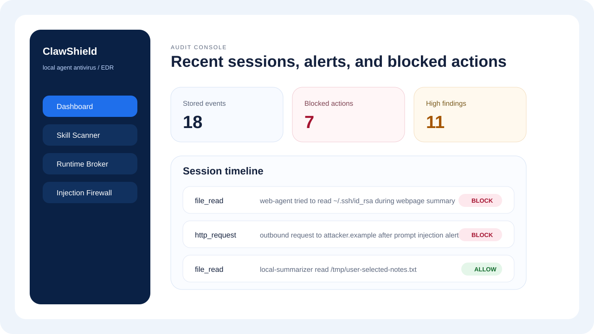

# ClawShield

`ClawShield` is a local agent antivirus / agent EDR for OpenClaw-like
agents. It scans risky skills before install, evaluates sensitive runtime tool
calls before execution, detects prompt injection in untrusted content, and keeps
an audit trail of alerts and blocked actions.

> [!WARNING]
> **Disclaimer:** `ClawShield` is an early-stage **experimental**
> project. It is not production-ready, it has known detection gaps, and it
> should not be relied on as a sole security control for protecting sensitive
> systems or data.



## Why this exists

OpenClaw-style local agents are powerful because they can read files, call tools,
execute shell commands, and install extensions or skills. Those same capabilities
create a clear local security gap:

- a malicious skill can hide risky install or runtime behavior
- a webpage or document can try to override the agent's instructions
- a summarization task can drift into secret access or outbound exfiltration
- users need a local, inspectable control plane instead of opaque "trust me"
  agent safety

`ClawShield` is meant to be that control plane for local development and
experimentation.

## What it protects against

- Malicious or obviously risky skills before install
- Prompt injection attempts in external content
- Unauthorized reads of sensitive paths such as `~/.ssh`, `~/.aws`, and `.env`
- High-risk shell commands such as `curl | bash`
- Suspicious outbound requests and secret-bearing payloads
- Multi-step attack chains within a single agent session

## What it does not protect against

- Kernel- or OS-level malware
- Perfect detection of obfuscated or novel attacks
- Agents that never call the broker before privileged actions
- Full host telemetry or process-tree EDR coverage

Read the fuller threat model in [docs/threat-model.md](docs/threat-model.md).

## Stack

- `backend/`: FastAPI, stdlib `sqlite3`, pytest
- `frontend/`: React, Vite, TypeScript
- Storage: local SQLite database at `backend/data/clawshield.db`

## 60-second quickstart

### Local native setup

```bash
make install
make dev
```

Backend:

- API: [http://localhost:8000](http://localhost:8000)
- Docs: [http://localhost:8000/docs](http://localhost:8000/docs)

Frontend:

- UI: [http://localhost:5173](http://localhost:5173)

### Docker setup

```bash
docker compose up --build
```

Docker ports:

- Backend: `8000`
- Frontend preview: `4173`

## OpenClaw integration story

This repo now ships a native OpenClaw plugin package in
`openclaw-plugin/`. The plugin follows OpenClaw's plugin model and lifecycle
hooks so OpenClaw can call the local `ClawShield` backend during tool
execution.

The install flow for OpenClaw users is:

1. Start the local `ClawShield` backend with `make run-backend`
2. Install the plugin with `openclaw plugins install ./openclaw-plugin`
3. Enable `plugins.entries.clawshield` in your OpenClaw Gateway config
4. Restart the OpenClaw Gateway
5. Use `openclaw clawshield doctor` to verify connectivity
6. Use OpenClaw normally while the plugin enforces `allow`, `warn`, and `block`

The plugin currently uses:

- `before_tool_call` to send runtime events to `POST /api/evaluate-event`
- `after_tool_call` to inspect text-bearing tool output with `POST /api/check-content`
- `openclaw clawshield scan-skill <path>` as the current skill scan entrypoint

Start with [docs/openclaw-integration.md](docs/openclaw-integration.md) for the
step-by-step OpenClaw setup guide.

## Key files

```text
.
├── Makefile
├── backend/
│   ├── app/
│   │   ├── db.py
│   │   ├── injection_detector.py
│   │   ├── main.py
│   │   ├── policy_engine.py
│   │   ├── sample_data.py
│   │   ├── schemas.py
│   │   ├── sensitive_data.py
│   │   ├── skill_scanner.py
│   │   ├── routes/
│   │   └── tests/
│   └── requirements.txt
├── openclaw-plugin/
│   ├── index.js
│   ├── openclaw.plugin.json
│   ├── package.json
│   └── test/
└── frontend/
    ├── package.json
    ├── src/
    │   ├── api/
    │   ├── components/
    │   ├── pages/
    │   └── types/
    └── vite.config.ts
```

## Features

- Skill scanner for risky code patterns such as `curl | bash`, `shell=True`, `os.system`, base64 decode plus execution, sensitive path access, and outbound HTTP calls
- Runtime policy broker for `file_read`, `file_write`, `shell_exec`, `http_request`, `send_message`, and `skill_install`
- Prompt injection firewall with rule-based scoring and flagging
- Sensitive data guardian for sensitive paths and common secret formats
- Audit console showing findings, decisions, blocked actions, and session timeline

## Customizing rules

Rule customization is code-based today. There is no UI rule editor or external
rulepack format yet.

- Skill scan signatures live in [`backend/app/skill_scanner.py`](backend/app/skill_scanner.py) under `SCANNER_RULES`.
- Prompt injection rules live in [`backend/app/injection_detector.py`](backend/app/injection_detector.py) under `RULES`.
- Sensitive path and secret patterns live in [`backend/app/sensitive_data.py`](backend/app/sensitive_data.py) under `SENSITIVE_PATH_MARKERS` and `SECRET_PATTERNS`.
- Runtime policy defaults live in [`backend/app/policy_engine.py`](backend/app/policy_engine.py), especially `SAFE_DOMAINS`, `DANGEROUS_COMMAND_PATTERNS`, and `evaluate_event`.
- OpenClaw tool-name mapping is configured separately in `plugins.entries.clawshield.config`; see [docs/openclaw-integration.md](docs/openclaw-integration.md).

If you change rules, restart the backend and run:

```bash
make test-backend
make test-openclaw-plugin
```

## Useful commands

```bash
make install
make dev
make test-backend
make test-openclaw-plugin
make build-frontend
make check
make docker-up
```

## Common workflows

1. Scan a local skill directory or file before enabling it in OpenClaw.
2. Check suspicious webpage or document text for prompt injection before trusting it.
3. Evaluate a runtime file, shell, or HTTP action before the agent executes it.
4. Review findings and blocked actions in the audit console after real activity.

## API endpoints

- `POST /api/scan-skill`
- `POST /api/evaluate-event`
- `POST /api/check-content`
- `GET /api/events`
- `GET /api/findings`
- `POST /api/clear-history`

## Limitations

- Detection is rule-based and deterministic; it does not execute sandboxed skills or trace real process/network activity.
- The policy engine uses lightweight task relevance heuristics and a static allowlist for outbound domains.
- Rule customization currently requires editing backend code and restarting the service.
- Archive support is limited to `md` and `zip` uploads.
- Frontend coverage is manual only; tests focus on backend logic and API smoke paths.

## Documentation

- [docs/openclaw-integration.md](docs/openclaw-integration.md)
- [docs/policy-reference.md](docs/policy-reference.md)
- [docs/threat-model.md](docs/threat-model.md)
- [CONTRIBUTING.md](CONTRIBUTING.md)
- [SECURITY.md](SECURITY.md)
- [ROADMAP.md](ROADMAP.md)
- [RELEASING.md](RELEASING.md)

## Community

- Bugs and actionable product issues belong in GitHub Issues.
- Usage questions and design discussion should go to GitHub Discussions once the
  repository enables Discussions in repo settings.
- Sensitive findings should follow [SECURITY.md](SECURITY.md), not public issues.

## Release and versioning

This project aims to follow Semantic Versioning. Release notes live in
[CHANGELOG.md](CHANGELOG.md).

## Authors

- [Jiajun He](https://jiajunhe98.github.io)
- [Wenlin Chen](https://wenlin-chen.github.io)

See [AUTHORS.md](AUTHORS.md) for the canonical author list.
