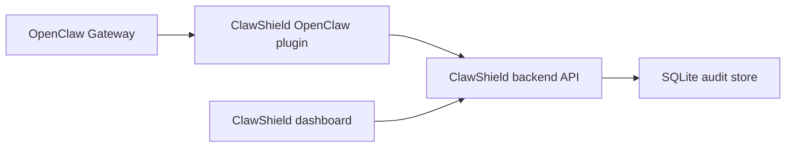

# OpenClaw Integration Guide

`ClawShield` integrates with OpenClaw as a native plugin package in
[`openclaw-plugin/`](../openclaw-plugin). That is the
right way to use it alongside OpenClaw because the official OpenClaw docs use
plugins plus lifecycle hooks around tool execution rather than external shell
wrappers.

## Mental model



The plugin runs inside OpenClaw. The backend stays local and makes the security
decisions. The frontend is only for visibility and audit review.

## What the plugin does today

- Uses `before_tool_call` to ask `ClawShield` whether a risky tool call should
  be allowed, warned, or blocked.
- Uses `after_tool_call` to inspect text-heavy tool output for prompt injection
  or secret exfiltration cues.
- Adds OpenClaw CLI helpers for health checks, plugin status, and manual skill
  scanning.

## Step by step

### 1. Start ClawShield locally

Run the backend first:

```bash
make run-backend
```

Or both backend and the frontend dashboard:

```bash
make dev
```

The backend API should be reachable at [http://127.0.0.1:8000](http://127.0.0.1:8000).

### 2. Install the OpenClaw plugin from this repo

From the repo root:

```bash
openclaw plugins install ./openclaw-plugin
```

This installs the plugin package declared by
[`openclaw-plugin/package.json`](../openclaw-plugin/package.json)
and
[`openclaw-plugin/openclaw.plugin.json`](../openclaw-plugin/openclaw.plugin.json).

### 3. Enable the plugin in your OpenClaw Gateway config

Add a `clawshield` entry under `plugins.entries`.

Example:

```json
{
  "plugins": {
    "entries": {
      "clawshield": {
        "enabled": true,
        "config": {
          "backendUrl": "http://127.0.0.1:8000/api",
          "blockOnWarn": false,
          "failClosed": true,
          "inspectToolResults": true,
          "fileReadTools": ["read"],
          "fileWriteTools": ["write", "edit", "apply_patch"],
          "shellTools": ["exec", "bash", "process"],
          "httpTools": ["browser", "web_fetch", "web_search"],
          "contentInspectionTools": ["browser", "web_fetch", "web_search", "read"],
          "ignoredTools": ["session_status"],
          "unclassifiedToolPolicy": "block"
        }
      }
    }
  }
}
```

### 4. Match the tool-name lists to your OpenClaw install

This step means: tell the `ClawShield` plugin which OpenClaw tool names should
be treated as file reads, file writes, shell commands, HTTP/web tools, or tools
to ignore.

For most users, you do not need to inspect `~/.openclaw/openclaw.json` at all.
Those fields are optional and may not exist yet. `tools.allow`, `tools.deny`,
and `agents.list[].tools.*` are OpenClaw tool-restriction settings, not where
ClawShield gets its defaults from.

If you use a standard OpenClaw install, you can copy the default mapping below
and move on.

#### What to do

1. Open your OpenClaw config file:

```text
~/.openclaw/openclaw.json
```

2. Add this `clawshield` config under `plugins.entries.clawshield` if you do
   not already have it:

```json
{
  "enabled": true,
  "config": {
    "backendUrl": "http://127.0.0.1:8000/api",
    "blockOnWarn": false,
    "failClosed": true,
    "inspectToolResults": true,
    "fileReadTools": ["read"],
    "fileWriteTools": ["write", "edit", "apply_patch"],
    "shellTools": ["exec", "bash", "process"],
    "httpTools": ["browser", "web_fetch", "web_search"],
    "contentInspectionTools": ["browser", "web_fetch", "web_search", "read"],
    "ignoredTools": ["session_status"],
    "unclassifiedToolPolicy": "block"
  }
}
```

3. Restart the OpenClaw Gateway.

4. Only if you use extra plugin tools or a custom tool setup, adjust the lists
   above to include your actual tool names.

Put each tool name into the correct `ClawShield` category:

- `fileReadTools`: tools that read local files
- `fileWriteTools`: tools that write or patch files
- `shellTools`: tools that execute shell or runtime commands
- `httpTools`: tools that fetch remote URLs or make outbound HTTP requests
- `contentInspectionTools`: tools whose returned text should be checked for prompt injection
- `ignoredTools`: tools you do not want `ClawShield` to evaluate
- `unclassifiedToolPolicy`: what to do when OpenClaw calls a tool that is not
  in any of the lists above

#### Important notes

- You do not need `tools.allow`, `tools.deny`, `agents.list[].tools.allow`, or
  `agents.list[].tools.alsoAllow` to already exist. Those keys are optional.
- Start with the ready-made mapping above unless you know your setup uses
  different tool names.
- Use the exact tool names OpenClaw uses if you customize the mapping.
- Matching is case-insensitive.
- Do not put group names such as `group:plugins` into these lists. Use concrete
  tool names only.
- Unclassified tools are blocked by default. If OpenClaw calls a tool that is
  missing from these lists, add it to the right category or place it in
  `ignoredTools` if you intentionally do not want ClawShield to inspect it.
- Common built-in names from the official docs are:
  - file tools: `read`, `write`, `edit`, `apply_patch`
  - runtime tools: `exec`, `bash`, `process`
  - web/UI tools: `web_fetch`, `web_search`, `browser`
  - session/status tools: `session_status`

This plugin config only controls which OpenClaw tools map into which ClawShield
event types. The actual detection and policy rules still live in the backend.
If you want to add your own security rules, edit the backend files described in
[docs/policy-reference.md](policy-reference.md) and restart the backend.

### 5. Restart the OpenClaw Gateway

After the plugin is installed and configured, restart OpenClaw so the Gateway
loads the plugin and its hooks.

### 6. Verify the plugin can reach ClawShield

Use the plugin CLI helper:

```bash
openclaw clawshield doctor
```

To inspect the loaded plugin settings:

```bash
openclaw clawshield status
```

There is also a slash command:

```text
/clawshield-status
```

### 7. Use OpenClaw normally

You do not need to wrap commands or change your normal OpenClaw workflow once
the plugin is enabled.

The runtime behavior is:

1. OpenClaw is about to call a tool
2. The plugin maps that tool call into a `ClawShield` runtime event
3. The backend returns `allow`, `warn`, or `block`
4. The plugin lets the tool continue or blocks it inline
5. For configured text-heavy tools, the plugin also inspects returned content

### 8. Scan skills before you enable them

The plugin currently exposes skill scanning as an OpenClaw CLI helper:

```bash
openclaw clawshield scan-skill /absolute/path/to/skill
```

That command calls `POST /api/scan-skill` and prints the recommendation plus
findings.

For security, path-based scans are limited to configured scan roots. By
default, ClawShield allows:

- `~/.openclaw/skills`
- `~/.openclaw/workspace/skills`
- `<clawshield-repo>/skills`
- `<clawshield-repo>/backend/demo_skills`

If your skills live elsewhere, set `CLAWSHIELD_SCAN_ROOTS` on the backend to a
comma-separated list of allowed skill directories.

If `openclaw clawshield scan-skill /path/to/skill` returns `400 Bad Request`,
the most common cause is that the backend does not allow that path yet. In that
case:

1. Set `CLAWSHIELD_SCAN_ROOTS` where the backend service runs.
2. Restart the backend.
3. Re-run `openclaw clawshield scan-skill /path/to/skill`.

### 9. Review what happened in the ClawShield dashboard

Open [http://localhost:5173](http://localhost:5173) to review:

- blocked actions
- warnings
- prompt injection alerts
- scan findings
- session timelines

## What the plugin sends to ClawShield

### Runtime policy

The plugin sends structured events to:

- `POST /api/evaluate-event`

This is used for:

- file reads
- file writes
- shell commands
- outbound HTTP requests

### Content inspection

The plugin sends text-bearing tool output to:

- `POST /api/check-content`

This lets `ClawShield` flag tool output that tries to:

- override instructions
- exfiltrate secrets
- trigger dangerous tool use
- extract system prompts

### Skill scanning

The plugin exposes:

- `openclaw clawshield scan-skill <path>`

That currently calls:

- `POST /api/scan-skill`

## Current limitations

- The plugin only intercepts the tool names you configure.
- User-defined security rules are still code-based; there is no standalone
  rulepack file or UI rule editor yet.
- Skill scanning is currently a CLI helper, because the OpenClaw docs used for
  this repo document tool lifecycle hooks but do not document a dedicated
  skill-install lifecycle hook.
- `failClosed` defaults to `true`. If you turn it off and the backend is down,
  OpenClaw will keep running and the plugin will only log the backend failure.
- This is still an experimental security layer, not a complete sandbox or host
  EDR.

## Files to look at

- [`openclaw-plugin/index.js`](../openclaw-plugin/index.js)
- [`openclaw-plugin/openclaw.plugin.json`](../openclaw-plugin/openclaw.plugin.json)
- [`openclaw-plugin/README.md`](../openclaw-plugin/README.md)
- [`backend/app/routes/security.py`](../backend/app/routes/security.py)
